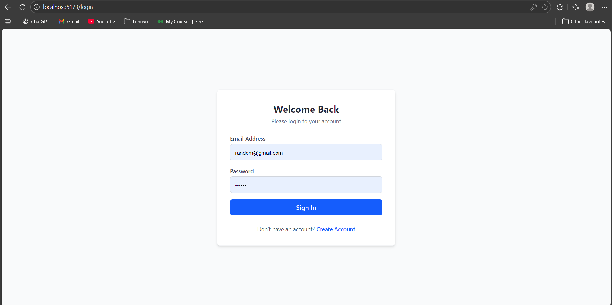
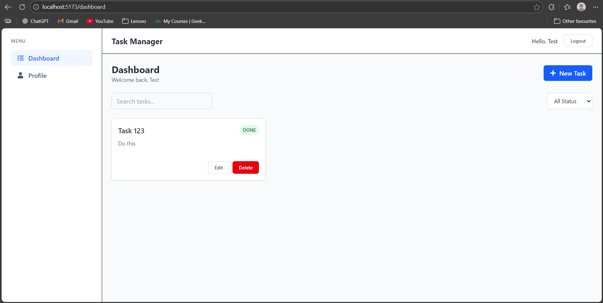
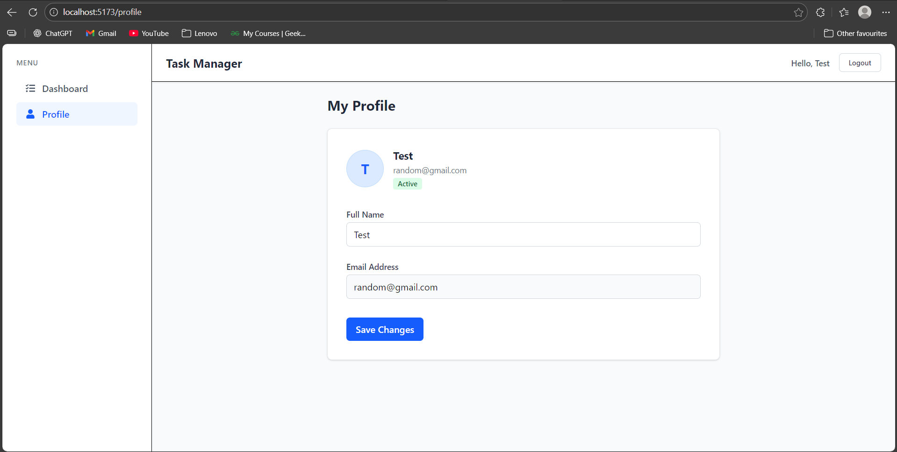
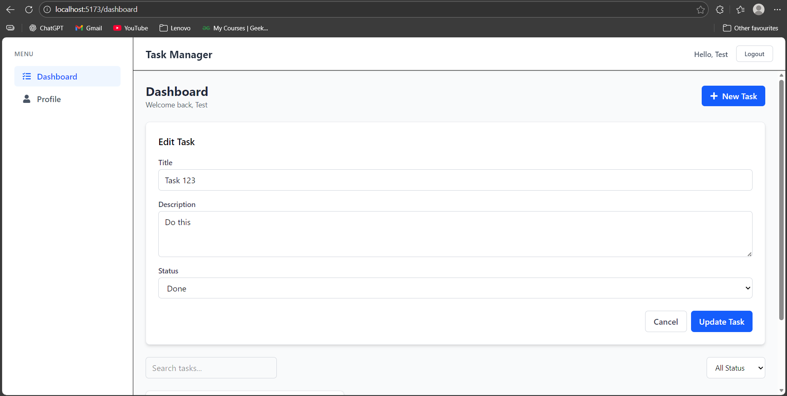

## Overview

This project was built as part of a Frontend Developer Intern assignment to demonstrate
my ability to design scalable frontend architecture, integrate secure authentication,
and build a production-ready dashboard using the MERN stack.

The focus was on clean code structure, security best practices, and frontend–backend integration.

# Scalable Web App with Authentication & Dashboard

> A modern, full-stack MERN application featuring JWT authentication, task management, and responsive design. Built as a Frontend Developer Internship assignment.

## 📸 Media Showcase

### 🎥 Application Demo


### 📱 Preview
<p align="center">
  
  
</p>
<p align="center">
  
  
</p>

---

**🔗 Quick Links:**
- 📖 [Installation Guide](./INSTALLATION.md) - Get started in 5 minutes
- 🚀 [Deployment Guide](./DEPLOYMENT.md) - Deploy to Vercel & Render
- 📚 [API Documentation](./API_DOCUMENTATION.md) - Complete API reference
- 🧪 [Testing Guide](./TESTING.md) - Manual testing procedures
- 📈 [Scaling Strategy](./SCALING.md) - Production scaling notes

---

## 🚀 Features

## Tech Stack

**Frontend**
- React (Vite)
- Tailwind CSS
- Axios
- React Router

**Backend**
- Node.js
- Express.js
- MongoDB
- JWT Authentication

**Security**
- bcrypt password hashing
- JWT middleware


## 📁 Project Structure

```
ScaleableWeb-App/
├── client/                 # React frontend
│   ├── src/
│   │   ├── api/           # API service layer
│   │   ├── components/    # Reusable components
│   │   ├── context/       # React Context (Auth)
│   │   ├── hooks/         # Custom hooks
│   │   ├── pages/         # Page components
│   │   ├── routes/        # Route protection
│   │   └── utils/         # Utilities & validators
│   └── package.json
└── server/                # Node.js backend
    ├── src/
    │   ├── config/        # Database & env config
    │   ├── controllers/   # Request handlers
    │   ├── middlewares/   # Auth & validation
    │   ├── models/        # Mongoose models
    │   ├── routes/        # API routes
    │   ├── utils/         # Helper functions
    │   └── server.js      # Entry point
    └── package.json
```

## 🛠️ Installation & Setup

### Prerequisites
- Node.js (v16+)
- MongoDB (local or Atlas)
- npm or yarn

### Backend Setup
```bash
cd server
npm install

# Create .env file
echo "PORT=5000
MONGO_URI=your_mongodb_connection_string
JWT_SECRET=your_jwt_secret_key
NODE_ENV=development" > .env

npm run dev
```

### Frontend Setup
```bash
cd client
npm install

# Create .env file
echo "VITE_API_URL=http://localhost:5000/api" > .env

npm run dev
```

## 📚 API Documentation

### Authentication Endpoints

#### Register User
```http
POST /api/auth/register
Content-Type: application/json

{
  "name": "John Doe",
  "email": "john@example.com",
  "password": "password123"
}

Response: {
  "_id": "...",
  "name": "John Doe",
  "email": "john@example.com",
  "token": "jwt_token_here"
}
```

#### Login User
```http
POST /api/auth/login
Content-Type: application/json

{
  "email": "john@example.com",
  "password": "password123"
}

Response: {
  "_id": "...",
  "name": "John Doe",
  "email": "john@example.com",
  "token": "jwt_token_here"
}
```

### User Profile Endpoints

#### Get Profile
```http
GET /api/user/profile
Authorization: Bearer <token>

Response: {
  "_id": "...",
  "name": "John Doe",
  "email": "john@example.com"
}
```

#### Update Profile
```http
PUT /api/user/profile
Authorization: Bearer <token>
Content-Type: application/json

{
  "name": "John Updated",
  "email": "john.new@example.com",
  "password": "newpassword123" // optional
}
```

### Task Endpoints

#### Get All Tasks
```http
GET /api/tasks
Authorization: Bearer <token>

# Optional query parameters:
# ?keyword=search_term
# ?status=todo|in-progress|done

Response: [
  {
    "_id": "...",
    "title": "Task Title",
    "description": "Task description",
    "status": "todo",
    "user": "user_id",
    "createdAt": "...",
    "updatedAt": "..."
  }
]
```

#### Create Task
```http
POST /api/tasks
Authorization: Bearer <token>
Content-Type: application/json

{
  "title": "New Task",
  "description": "Task description",
  "status": "todo" // optional, defaults to 'todo'
}
```

#### Update Task
```http
PUT /api/tasks/:id
Authorization: Bearer <token>
Content-Type: application/json

{
  "title": "Updated Task",
  "description": "Updated description",
  "status": "in-progress"
}
```

#### Delete Task
```http
DELETE /api/tasks/:id
Authorization: Bearer <token>

Response: { "message": "Task removed" }
```

## 🔐 Authentication Flow

1. User registers/logs in → Receives JWT token
2. Token stored in localStorage
3. Token sent in Authorization header for protected routes
4. Backend validates token via middleware
5. User data attached to request object

## 📱 Responsive Design

- Mobile-first approach with TailwindCSS
- Breakpoints: sm (640px), md (768px), lg (1024px)
- Fully responsive dashboard and forms
- Touch-friendly UI elements

## 🧪 Testing

### Manual Testing
1. Register a new user
2. Login with credentials
3. Create, edit, delete tasks
4. Test search and filter functionality
5. Update user profile
6. Logout and verify protected routes

## 🚀 Deployment

### Backend (Railway/Render/Heroku)
```bash
# Build command
npm install

# Start command
npm start

# Environment variables
PORT=5000
MONGO_URI=<production_mongodb_uri>
JWT_SECRET=<strong_secret_key>
NODE_ENV=production
```

### Frontend (Vercel/Netlify)
```bash
# Build command
npm run build

# Output directory
dist

# Environment variables
VITE_API_URL=<production_api_url>
```

## 📈 Scaling Considerations

See [SCALING.md](./SCALING.md) for detailed notes on production scaling strategies.

## 👨‍💻 Author

Built as part of a Frontend Developer Internship assignment demonstrating full-stack capabilities.

## 📄 License

MIT
